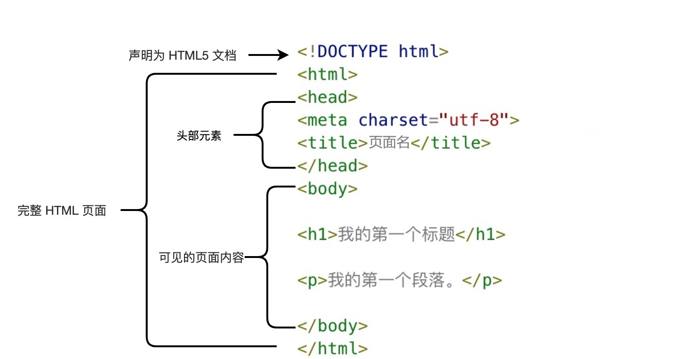

## HTML

### 实例



* &lt;!DOCTYPE html&gt; 声明为 HTML5 文档
* &lt;html&gt; 元素是 HTML 页面的根元素
* &lt;head&gt; 元素包含了文档的元（meta）数据，如 <meta charset="utf-8"> 定义网页编码格式为 utf-8。
* &lt;title&gt; 元素描述了文档的标题
* &lt;body&gt; 元素包含了可见的页面内容
* &lt;h1&gt; 元素定义一个大标题
* &lt;p&gt; 元素定义一个段落

### &lt;!DOCTYPE&gt; 标签

这其实不是一个页面结构的标签，只是用于告诉浏览器这是个什么文件

#### HTML5

```html
<!DOCTYPE html>
```

#### html4.01
```html
<!DOCTYPE HTML PUBLIC "-//W3C//DTD HTML 4.01 Transitional//EN"
"http://www.w3.org/TR/html4/loose.dtd">
```

#### XHTML 1.0
```html
<!DOCTYPE html PUBLIC "-//W3C//DTD XHTML 1.0 Transitional//EN"
"http://www.w3.org/TR/xhtml1/DTD/xhtml1-transitional.dtd">
```

### html tag

所有的html页面顶层tag都是```<html>```

### head tag

* 包含了所有的头部标签元素。
* 在 <head>元素中你可以插入脚本（scripts）, 样式文件（CSS），及各种meta信息。
* 可以添加在头部区域的元素标签为: ```<title>, <style>, <meta>, <link>, <script> 和 <base>```

#### title

* 定义了不同文档的标题。
* 在 HTML/XHTML 文档中是必需的。
* 定义了浏览器工具栏的标题
* 当网页添加到收藏夹时，显示在收藏夹中的标题
* 显示在搜索引擎结果页面的标题

#### style

* 标签定义了HTML文档的样式文件引用地址
* 元素中你也可以直接添加样式来渲染 HTML 文档

```html
<head>
<style type="text/css">
body {
    background-color:yellow;
}
p {
    color:blue
}
</style>
</head>
```

#### meta

* 提供了元数据.元数据也不显示在页面上，但会被浏览器解析
* 元数据可以使用于浏览器（如何显示内容或重新加载页面），搜索引擎（关键词），或其他Web服务
* 常见用法
  * 为搜索引擎定义关键词:  
  ```html
  <meta name="keywords" content="HTML, CSS, XML, XHTML, JavaScript">
  ```
  * 为网页定义描述内容:  
  ```html
  <meta name="description" content="免费 Web & 编程 教程">
  ```
  * 定义网页作者:  
  ```html
  <meta name="author" content="Runoob">
  ```
  * 每30秒钟刷新当前页面:  
  ```html
  <meta http-equiv="refresh" content="30">
  ```

#### link

* 定义了文档与外部资源之间的关系
* 通常用于链接到样式表

```html
<link href="SimpleStyle.css" rel="stylesheet" />
```

#### script

* 用于加载脚本文件，如： JavaScript

### Body Tag

* 定义了 HTML 文档的主体。

#### h

* 通过 ```<h1>``` - ```<h6>``` 标签进行定义的
* ```<h1>``` 定义最大的标题， ```<h6>``` 定义最小的标题
* 确保```<h>```标签只用于标题。不要仅仅是为了生成粗体或大号的文本而使用标题
* 搜索引擎使用标题为您的网页的结构和内容编制索引
* 对于主流浏览器来说，h4-h6看起来是一样的，但是他们代表不一样的层次结构

#### p

* 可以将文档分割为若干段落

#### br

* 不产生新段落情况下换行
* 所有空白会被忽略，包括空格、tab、回车换行

#### 注释

* ```<!-- XXXX -->```
* 用来给开发者自己看的，说明某段代码
* 用户不会看到相关内容

#### 编号列表 Numbered(Ordered) List

```html
<h1>How to Boil an Egg</h1>
<ol>
    <li>Put eggs in a pot filled with cold water</li>
    <li>Bring the water to a boil</li>
    <li>Take the pot off the heat, cover it, and let it sit for 12 minutes</li>
    <li>Remove the eggs from the hot water and cool them by
        running water over them or placing them in a bowl of
        ice water to cool off</li>
    <li>Peel and eat</li>
</ol >
```

style="list-style-type: {value}"

| value       | Description                                                   |
|-------------|---------------------------------------------------------------|
| decimal     | Standard Arabic numerals (1, 2, 3, 4, and so on)              |
| lower-alpha | Lowercase letters (a, b, c, d, and so on)                     |
| upper-alpha | Uppercase letters (A, B, C, D, and so on)                     |
| lower-roman | Lowercase Roman numerals (i, ii, iii, iv, and so on)          |
| upper-roman | Uppercase Roman numerals (that is, I, II, III, IV, and so on) |

```html
<p>The Days of the Week in French:</p>
<ol style="list-style-type: lower-alpha">
  <li>Lundi</li>
  <li>Mardi</li >
  <li>Mercredi</li>
  <li>Jeudi</li>
  <li>Vendredi</li>
  <li>Samedi</li>
  <li>Dimanche</li>
</ol>
```

start=3

value=10

#### 无编号列表 UnOrdered List

```html
<ul style="list-style-type: disc">
    <li>DAT - Digital Audio Tapes</li>
    <li>CD - Compact Discs</li>
    <li>Cassettes</li>
</ul>
<ul style="list-style-type: square">
    <li>DAT - Digital Audio Tapes</li>
    <li>CD - Compact Discs</li>
    <li>Cassettes</li>
</ul>
<ul style="list-style-type: circle">
    <li>DAT - Digital Audio Tapes</li>
    <li>CD - Compact Discs</li>
    <li>Cassettes</li>
</ul>
<ul style="list-style: URL(ChromeBullet.png)">
  <li>DAT - Digital Audio Tapes</li>
  <li>CD - Compact Discs</li>
  <li>Cassettes</li>
</ul>
```

#### Definition Lists

```html
<dl>
    <dt>Basil</dt>
    <dd>Annual. Can grow four feet high; the scent of its tiny white flowers is heavenly</dd>
    <dt>Oregano</dt>
    <dd>Perennial. Sends out underground runners and is difficult to get rid of once established.</dd>
    <dt>Coriander</dt>
    <dd>Annual. Also called cilantro, coriander likes cooler weather of spring and fall.</dd>
</dl>
```

#### Nesting Lists

```html
<h1>Peppers</h1>
<ul>
    <li>Bell</li>
    <li>Chile</li>
        <li>
            <ul>
            <li>Serrano</li>
            <li>Jalapeno</li>
            <li>Habanero</li>
            <li>Anaheim</li>
            </ul>
        </li>
    <li>Szechuan</li>
    <li>Cayenne</li>
</ul>
```

#### a

```html
Go to <a href="http://www.baidu.com">Baidu</a>
```


