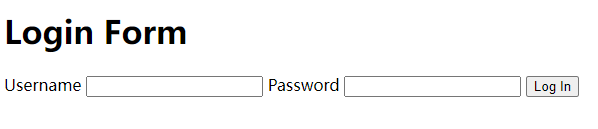

## 布局

### 常规布局

### 网格

### 浮动

### Position 定位

position属性可以有四种取值：

* static
* relative
* absolute
* fixed

#### static

默认是static，就是正常的从上到下，从左往右

#### relative

* top
* left

#### absolute

#### fixed

## Forms



### &lt;label&gt;

```html
<label for="username">Username</label>
```

### &lt;input&gt;

```html
<input type="text" name="username">
```

#### type=text

##### size

表示字节数，根据这个值展示输入框的**大致**宽度

会被width属性覆盖

##### maxlength

可以输入的最多字数

##### value

默认值

##### placeholder

提示

##### required

##### minlength

##### list

下拉框

```html
<datalist id="game">
    <option value="rock">
    <option value="paper">
    <option value="scissors">
    <option value="unicorn">
    <option value="sledgehammer">
</datalist>
<label>
Your Move:
<input id="move" list="game">
</label>
```

#### type=range

滑动条

```html
<label>How much do you like our product?<br>
    Not at all <input type="range" min="0" max="5" value="4.3"> More than anything
</label>
```

#### type=date

```html
<label>When can you return the book?<br>
<input type="date">
</label>
```

#### type=color

```html
<label>What is your favorite color?
<input type="color" id="favoritecolor">
</label>
```

#### type=password

```html
<input type="password">
```

#### type=submit

```html

```


