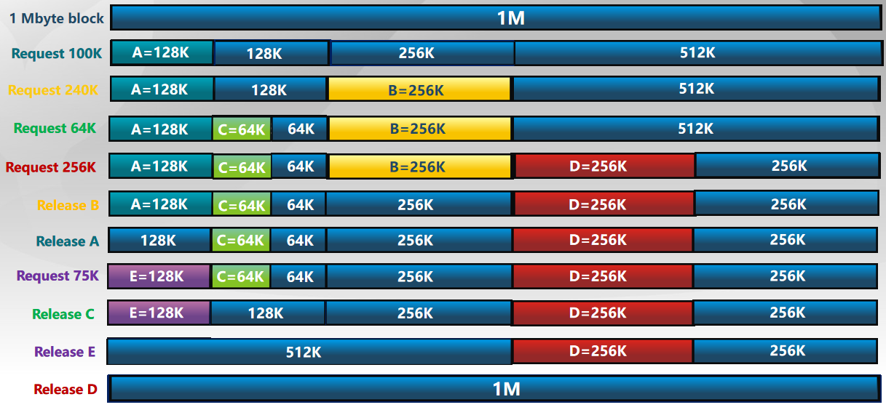
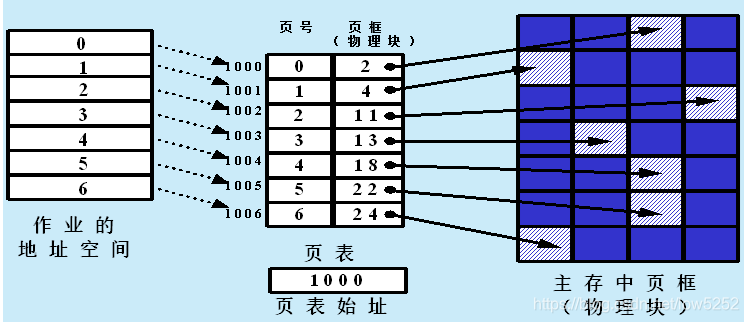
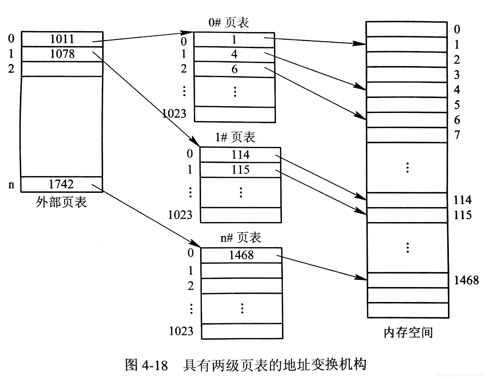

## 内存分配

2023.q3 / 2022.q4 / 2021.q4

### 连续内存分配

#### 内存碎片问题

空闲内存不能被利用

##### 外部碎片

分配单元之间的未被使用内存

##### 内部碎片

分配单元内部的未被使用的内存

#### First Fit

在内存中找到第一个比需求大的空闲块，分配给程序

#### Best Fit

在内存中找到最小、最适合的空闲块，分配给程序

#### Worst Fit

在内存中找到最大的空闲块，分配给程序

#### 比较

| 分配方式 | First Fit    | Best Fit              | Worst Fit                        |
|------|--------------|-----------------------|----------------------------------|
| 优势   | 简单/易于产生较大内存块 | 比较简单，大部分分配是小尺寸时高效     | 分配很快，大部分是中尺寸时高效                  |
| 缺陷   | 产生外部碎片，不确定性  | 产生外部碎片，重分配慢，很多没用的微小碎片 | 产生外部碎片，重分配慢，易于破碎大的空闲块以至于大分区无法被分配 |

#### Buddy allocation

整个可分配的分区大小为2u

需要的分区大小

* 2u-1<s≤2u时，把整个块分配给该进程;
* s≤2i-1，将大小为2i的当前空闲分区划分成两个大小为2i-1的空闲分区，重复划分过程，直到2i-1<s≤2i，并把一个空闲分区分配给该进程

### 非连续内存分配

#### 分页

缺陷：由于页表必须连续存放，并且需要常驻物理内存，当逻辑地址空间很大时，导致页表占用内存空间很大。
物理4G，分页4k，页表1M条数，4Byte/条，4M
#### 二级分页

#### 多级分页
