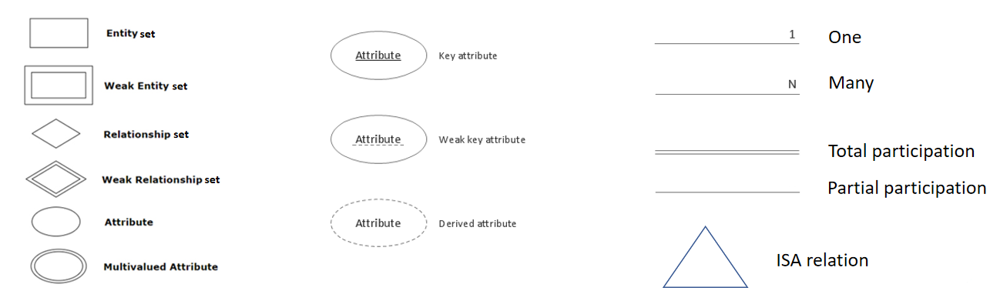
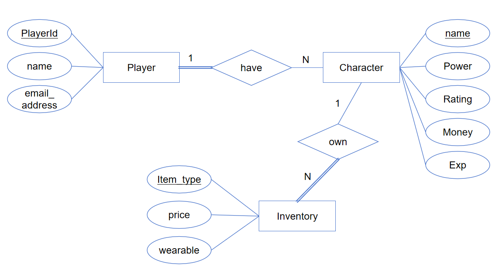

## ER图

[Week1.pptx](../course/Week1.pptx)  
exam2023.q1

### 符号

### 2023.q1

Relational Schema:

Player
Attributes: playerID, Name, email_address
Primary Key: playerID

Character
Attributes: characterID, characterName, Power, Rating, Money, ExperienceScore, playerID   
Primary Key: characterID  
Foreign Key: playerID references playerID in Player  

Inventory
Attributes: inventoryID, Item_type, Price, Wearable, characterID  
Primary Key: inventoryID  
Foreign Key: characterID references characterID in Character

Integrity Constraints:

Domain Constraints:
playerID, characterID, inventoryID 应该是数字类型 (例如INT) 而且不能为空  
Name, email_address, characterName, and Item_type 应该是字符串类型 (例如VARCHAR) 而且需要根据需求确定是否能为空  
Power, Rating, Money, ExperienceScore, Price 应该是数字类型 (例如DECIMAL或FLOAT) 而且需要根据需求确定是否能为空，是否能为负数，小数点保留位数等  
Wearable 应该是布尔类型 (例如BOOLEAN)

Entity Integrity:
每张表都应该有主键，用于唯一标识一条记录
主键不能为Null

Referential Integrity:
Character表中的外键playerID是Player表的主键  
Inventory表中的外键characterID是Character表的主键

asdfasd

a
asdf

π_CharName(Characters ⨝_A.AccountNo=Players.AccountNo (Players ∣ email[email LIKE '%@example.com']))

 