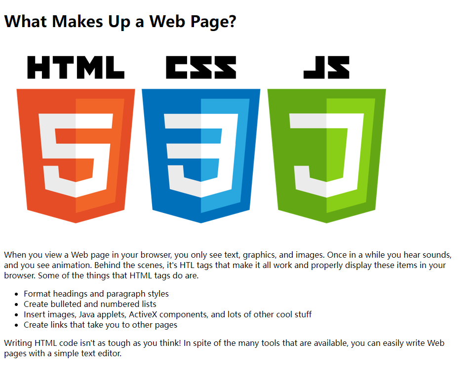

## What is Web Publishing

* How the World Wide Web really works
* What web browsers do, and which browsers your audience will be using
* What a web server is, and why you need one
* Some information about uniform resource locators (URLs)

### The Web is

* A hypertext（超文本） information system
* Cross-platform（跨平台）
* Distributed（分布式）
* Dynamic（动态）
* Interactive（交互）

### Web Browsers

* Google Chrome 65%
* Microsoft Internet Explorer
* Microsoft Edge 5%
* Mozilla Firefox 3%
* Apple Safari 18%

### Web Servers

### Uniform Resource Locators (URL)


#### 协议

http / https / ftp / mailto 等等

#### 域名

www.example.com

#### 端口

http默认80，https默认443

#### 资源路径

/path/to/file.html

早期阶段，表示Web服务器上的物理文件位置  
如今，基本上是对资源的抽象

https://news.qq.com/ch/tech

#### 参数

?key1=value1&key2=value2

https://cn.bing.com/search?q=web

#### 锚点

#SomewhereInTheDocument 是资源本身的另一部分的锚点。  
锚点表示资源中的一种“书签”，给浏览器显示位于该“加书签”位置的内容的方向。  
不会发送给服务器

https://springdoc.cn/spring-boot/cli.html#cli.using-the-cli.embedded-shell

## Getting Your Tools in Order

### Text Editor

[notepad++](https://notepad-plus-plus.org/downloads/)

[visual studio code](https://code.visualstudio.com/)

### Browser

[chrome](https://www.google.cn/chrome/)

### Developer tools

### Wireframing Your Website

### Web Hosting

## Introducing HTML and CSS

### HTML

HyperText Markup Language（HTML）超文本标记语言，是一种用来结构化 Web 网页及其内容的标记语言。   
不是变成语言。  
网页内容可以是：一组段落，一个重点信息列表，也可以含有图片和数据表。

simple page:

```html
<!DOCTYPE html>
<html lang="en">
    <head>
        <title>Simple page</title>
    </head>
    <body>
        <p>hello world</p>
    </body>
</html>
```

HTML文件包含：

* The text of the page itself
* HTML tags

#### HTML Tags

大部分html tags是这样的

```html
<thetagname>affected text</thetagname>
```

有些tag是可以指定属性的

```html
<thetagname theAttribute="theAttributeValue">affected text</thetagname>
```

大小写不敏感

可以嵌套

example:



### CSS

Cascading Style Sheets（CSS）是一门样式表语言，也不是真正的编程语言，甚至不是标记语言。  
人们可以用它来选择性地为 HTML 元素添加样式。


