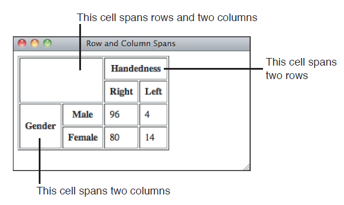

 ## Building Tables

| Name  | Grade | Rank |
|-------|-------|------|
| Tong  | 100   | 1    |
| Peter | 95    | 2    |
| Allen | 90    | 3    |

### &lt;table&gt;

表格

```html
<table>
    表头（可选）和内容
</table>
```

### &lt;caption&gt;

表头

```html
<table>
    <caption>Vital Statistics</caption>
</table>
```

### Rows and Cells

#### &lt;tr&gt;

行

#### &lt;th&gt;

table heading cells 表头单元格，默认粗体

#### &lt;td&gt;

table data cells

### 示例

```html
<table border="1">
    <caption>Vital Statistics</caption>
    <tr>
        <th>Name</th>
        <th>Height</th>
        <th>Weight</th>
        <th>Eye Color</th>
    </tr>
    <tr>
        <td>Alison</td>
        <td>5'4"</td>
        <td>140</td>
        <td>Blue</td>
    </tr>
    <tr>
        <td>Tom</td>
        <td>6'0"</td>
        <td>165</td>
        <td>Hazel</td>
    </tr>
    <tr>
        <td>Susan</td>
        <td>5'1"</td>
        <td>97</td>
        <td>Brown</td>
    </tr>
</table>
```

### Empty Cells

### Captions

### Style

#### table width

#### border

#### column width

#### table and cell color

#### span rows and columns

