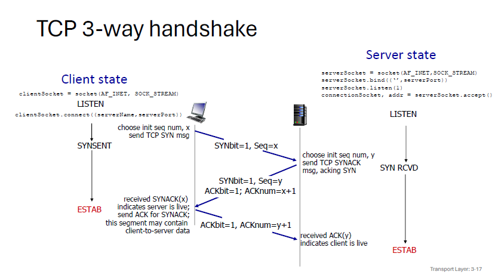

exam2022.q3

a.

i.

ii.

Can not tell

iii.

Can not tell

错误重传策略：

* Stop And Wait
* Go-Back-N  
  * 发送方连续发送多个帧，接收方按顺序逐个确认。如果发送方未收到确认，会回退到出错的帧并重新发送该帧及其后的所有帧。 
  * 在网络延迟或丢包率较高时，可能需要频繁地重传数据帧，这可能导致网络带宽的浪费。
  * 适用于网络条件较好，丢包率和延迟较低的环境，或者对实时性要求较高而可以容忍一定带宽浪费的场景。
* Selective Repeat  
  * 接收方可以选择性地确认每个正确接收的帧，而发送方只需重新发送那些未被确认的帧。
  * 由于只需重传丢失或损坏的帧，因此能更好地利用网络带宽。
  * 更适用于网络条件较差，丢包率和延迟较高的环境，因为它能更有效地利用网络资源。

b.

* 无连接性，意味快速及开销低
* 低延迟，如在线游戏、实时音视频通信等
* 简单性，适用于资源受限的环境，如嵌入式系统或物联网设备
* 广播和多播支持，非常适合于需要向多个接收者同时发送相同数据的场景
* 灵活性：UDP提供了更大的灵活性，允许开发者自定义错误处理、拥塞控制和重传策略

c.

i.

t0-t1慢启动，t1-t2拥塞控制，t2快速重传

ii.

Tahoe和Reno的主要区别在于对重复ACK的处理。

Tahoe在拥塞时将ssthresh值减半，并进入Slow start  
Reno在拥塞时将ssthresh值减半，并线性增长

d.

i.

UDP不保证包的时序，所以收到的packet顺序不一定与发送方一致，以至于文件不一定正确

ii.

UDP没有拥塞控制，会一直占用带宽，TCP因为有拥塞控制，带宽被占满后会降低传输速率

exam2022.q4

a. 

DNS Query:  
My host sends a UDP DNS query to the DNS resolver (1.1.1.1) requesting the IP address for print.lancaster.ac.uk.

DNS Response:  
The DNS resolver replies with a UDP DNS response containing the IP address for print.lancaster.ac.uk.

TCP SYN:  
My host initiates a TCP connection to the web server (using the IP from DNS) by sending a TCP SYN packet to the port 80 of the web server.

TCP SYN-ACK:  
The web server replies with a TCP SYN-ACK packet acknowledging the SYN packet from your host.

TCP ACK:  
My host sends a TCP ACK packet to complete the three-way handshake and establish the TCP connection.

HTTP GET Request:  
My host sends an HTTP GET request to the web server, requesting the path /app?service=page/UserSummary.

HTTP Response:  
The web server replies with an HTTP response containing the status code 200 OK and the requested web page.

TCP ACK:  
My host acknowledges the receipt of the HTTP response with a TCP ACK packet.

TCP FIN:  
After receiving the complete web page, my host sends a TCP FIN packet to initiate the closure of the TCP connection.

TCP ACK:  
The web server acknowledges the FIN packet with a TCP ACK packet.

TCP FIN:  
The web server sends a TCP FIN packet to complete the closure of the TCP connection.

TCP ACK:  
My host acknowledges the FIN packet from the web server with a TCP ACK packet, completing the four-way handshake and closing the TCP connection.

b.

i.

AS 1 不可达

ii.

建立AS 5到AS 1直接可达  
通过AS 2.3.4可达AS 1

c.

D无法处理，需要Application Layer，因为需要用户信息

d.

使用If-Modified-Since头部：   
客户端在发送GET请求时，可以在请求头部包含If-Modified-Since字段，其值为上次从服务器获取资源时的时间戳。  
服务器接收到请求后，会检查资源的最后修改时间。如果资源自上次客户端请求后未被修改（即资源的最后修改时间早于或等于If-Modified-Since头部指定的时间），服务器将返回一个304 Not Modified的响应码，告诉客户端可以继续使用其缓存中的资源版本。  
如果资源已经被修改，服务器将返回新的资源内容，并附带新的Last-Modified头部，响应码为200 OK。
